The goal of this tutorial is to demostrate the use of Logistic Regression, and model diagnostics for this type of regression. We will start this tutorial by explaining the algorithm and the modeling behind Logistic regression. This would be followed by an illustrative example using three statistical software languages: Python, R, and STATA.

##Algorithm
Logistic regression is a predictive modelling algorithm that is used when the response variable is binary categorical variable, i.e. it can only take two values: 0 and 1. 

##Data Summary

In this tutorial, we work on the `pima` dataset from `faraway v1.0.7` in R, 
which has 9 variables. The data comes from a National Institute of Diabetes and 
Digestive and Kidney Diseases study on 768 adult female Pima Indians living near Phoenix.
Different measurements of the subjects were taken and it was recorded whether or not
the patient showed signs of diabetes.

##Languages {.tabset}

###R

In order to run this analysis in R, we need to install two key packages: "Faraway" and "ResourceSelection" The former is required to access the data used in this illustration and the latter is used to run the model diagnostics. Once installed with the command, install.packages(“packagename”), they can be loaded using library( ).

**Loading Dataframe and Numerical Summaries**

Once the dataframe "pima" is loaded, we can view the summaries of the variables by using the function, summary.

```{r pima}
library(faraway)
data(pima)
summary(pima)
```

The variables: "diastolic", "insulin", "glucose" and "bmi" exhibit zero values, since that is not physically possible we conclude that these are measurement errors or missing values might have been coded as 0. In an attempt to clean up the data, we remove these values.

```{r message = FALSE}
library(dplyr)
pima_clean = filter(pima, diastolic > 0 & bmi > 0) %>% filter(insulin > 0 & glucose > 0)
summary(pima_clean)
```

**Model Selection using the Backward Elimination method**

We use the Backward elimination method to select the model specification, with the BIC as a guide. Please note that a lower BIC indicates improved fit of the model. So, we will be focusing on the individual p-values for the variables and the BIC for the model. 

We start with a logistic model with "test" as the response variable and all the other variables as explanatory. 
```{r logisticmodel}
Fit = glm(test~ ., family = binomial(link="logit"), data = pima_clean)
summary(Fit)
BIC(Fit)
```
The stepwise elimination of variables that are individually statistically insignificant and improve the BIC, results in the final model specification with four idependent variables: age, bmi, glucose, and diabetes.
```{r finalmodel}
Fit_final = glm(test~ glucose+bmi+diabetes+age, family = binomial(link="logit"), data = pima_clean)
summary(Fit_final)
BIC(Fit_final)
```
The estimated coefficients indicate the change in the log odds of the response when the predictors change by one unit. For example, the log odds of testing positive for diabetes increases by 0.053 when age increases by one unit.In addition, we can obtain the confidence intervals for the coefficient estimates as given below (Note, that these confidence intervals are based on the standard errors and rely on the normality assumption).
```{r message = FALSE}
#computing confidence intervals:
confint(Fit_final)
```

**Goodness of Fit**

*Hosmer-Lemeshow Test*

We apply the Hosmer-Lemeshow test to assess the fit of the model. We check the null hypothesis that the specified logistic regression model is the correct model. Since the p-value is high, we fail to reject the null hypothesis.
```{r message = FALSE}
library(ResourceSelection)
h1 = hoslem.test(Fit_final$y, fitted(Fit_final), g = 10)
h1
```

In addition, the Hosmer–Lemeshow test specifically identifies subgroups as the deciles of fitted probability values. Models for which the expected and observed probabilities in subgroups are similar are considered to be well calibrated. This provides evidence that our model is well calibrated.

```{r HL1}
library(ResourceSelection)
#inspect the expected and observed values
h2 = cbind(h1$expected, h1$observed)
h2
```

**Confusion Matrix**

This provides us with another tool to evaluate the model. It gives us a measure of the Type 1 and Type 2 error in our modeling. Thus the diagonal gives the count of the instances when our model predicts correctly. Inspecting the Confusion matrix for our data we deduce that the overall predicted accurancy for our model is around 80 percent. 
```{r CM}
p = predict(Fit_final, pima_clean, type = "response")
Con_table = table(p > 0.5, pima_clean$test)
Con_table
```

**Reciever Operating Characteristic (ROC) Curve**

Finally, we inspect the ROC curve. This curve plots the the false positive rate against the true probablistic prediction for a range of threshold probabilities. The area under the curve is viewed as a measure of prediction accuracy. The larger the area under the curve, and hence the farther away the ROC curve is from the diagonal, the better the model performance. Computing the area under the curve (AUC) allows us to quantitatively evaluate the model, performance. This could serve as a useful tool for model comparision as well.


```{r roc, message = FALSE}
library(ROCR)
p = predict(Fit_final, pima_clean, type = "response")
pred = prediction(p, pima_clean$test)
roc = performance(pred, "tpr", "fpr")
plot(roc,
     main = "ROC Curve")
abline(a=0, b=1)
#Higher area under the curve the better the fit (AUC)
auc = performance(pred, "auc")
auc = unlist(slot(auc, "y.values"))
auc = round(auc, 2)
legend(.6, .2, auc, title = "Area under the Curve", cex = .75)
```


**Summary**

In this tutorial we illustrated how to implement logistic regression and conduct model diagnostics. 

**References**

Hosmer, D. & Lemeshow, S. (2000). Applied Logistic Regression (Second Edition). New York: John Wiley & Sons, Inc.
UCLA Institute for Digital Research and Education website: https://stats.idre.ucla.edu/r/dae/logit-regression/


###Python 


###STATA

For Stata, all functions for the tests in this tutorials are built-in, 
so there is no need to install or load any additional packages prior
to performing the analysis in this tutorial. 

**Loading Dataset and Numerical Summaries**

The data set was exported from R into a comma-separated variable file 
`pima.csv`. We can import and summarize the pima dataset from a CSV 
file using the following:

```
import delimited using pima.txt, clear
summarize
```

```{r, out.width = "60%", echo=FALSE}
library(knitr)
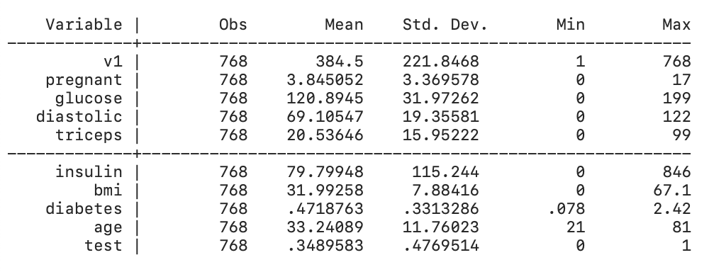 
```

We see from the summary that the data for `bmi`, `diastolic`, `glucose`, and 
`triceps` contain 0 values, which are not possible measures of these
parameters. We must therefore clear rows with these values from our dataset.
We can do this as follows:

```
drop if glucose == 0 | diastolic == 0 | triceps ==0 | insulin == 0 | bmi == 0
summarize 
``` 

```{r, out.width = "60%", echo=FALSE}
library(knitr)
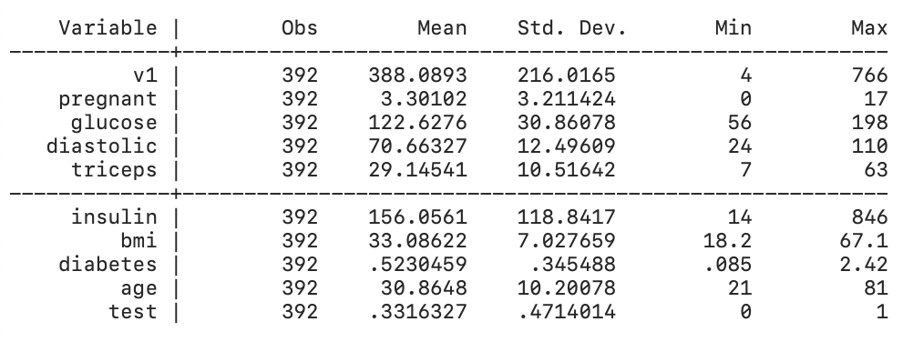 
```


We can see that we now have 392 observations from the initial 768, and
all values are now within reasonable range. 

**Model Selection using the Backward Elimination method**  

For this model, our response variable is `test` which indicates whether
or not a patient tested positive for diabetes. Note that the rest of the 
variables are numeric and continuous, so we can use them as-is in our
regression model. Using all other variables as independent variables,
we can generate the full model using this code:

```
logit test pregnant glucose diastolic triceps insulin bmi diabetes age
```

```{r, out.width = "60%", echo=FALSE}
library(knitr)
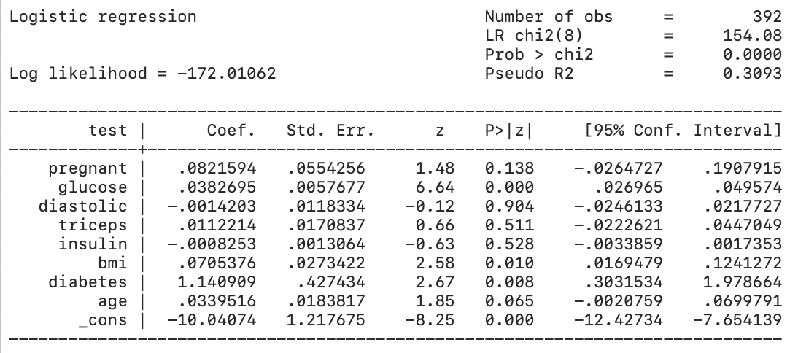 
```


We now want to determine the best fit model for the given data. Starting with the
full model, we use backward elimination to drop variables one-by-one and the
Bayesian Information Criterion (BIC) to determine if the model is an improvement
from the previous model. 
  
We first get the BIC of the model using the following command: 
```
estat ic
```

```{r, out.width = "60%", echo=FALSE}
library(knitr)
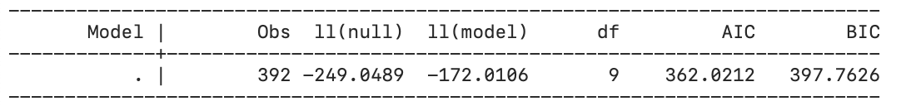 
```

To determine the order at which to drop the variables, we can use Stata's `stepwise`
function using a 95% confidence level. 
```
stepwise, pr(0.05): logit test pregnant glucose diastolic triceps insulin bmi diabetes age
```

```{r, out.width = "60%", echo=FALSE}
library(knitr)
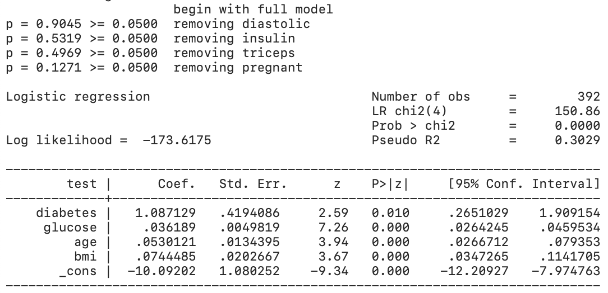 
```
  
From this, we get the dropping order `diastolic`, `insulin`, `triceps`, `pregnant`.

First, we drop `diastolic`:
```
// Model 1 (drop diastolic):
quietly logit test pregnant glucose triceps insulin bmi diabetes age
estat ic
```

```{r, out.width = "60%", echo=FALSE}
library(knitr)
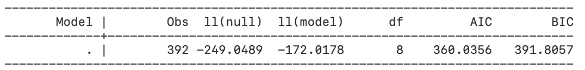 
```

From this, we get a BIC of 391.8057, an improvement from the full model. 
We then drop `insulin`:

```
// Model 2 (drop insulin):
quietly logit test pregnant glucose triceps bmi diabetes age
estat ic
```

```{r, out.width = "60%", echo=FALSE}
library(knitr)
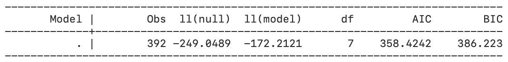 
```

Our BIC is now 386.223. Dropping the variable `triceps`, we get another
model iteration:
```
// Model 3 (drop triceps): 
quietly logit test pregnant glucose bmi diabetes age
estat ic
```

```{r, out.width = "60%", echo=FALSE}
library(knitr)
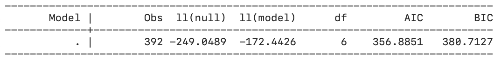 
```

This gives us a BIC of 380.7127, still an improvement from the previous.
Lastly, dropping `pregnant`, we use the following code and get the
model summary:

```
// Model 4 (drop pregnant): 
logit test glucose bmi diabetes age
estat ic
```

```{r, out.width = "60%", echo=FALSE}
library(knitr)
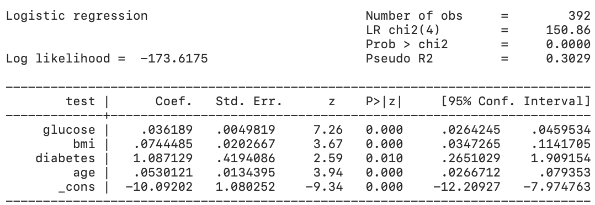 
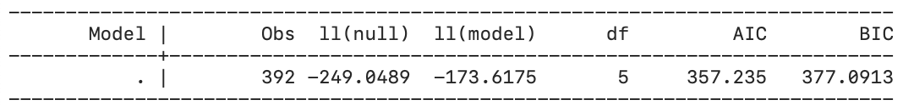 
```

We see that all variables are now signifcant and we get a minimized BIC of 
377.0913 for this model. 

Now that we have a final model, we can create a new column `p` which contains
the fitted values of our model using the following command:

``` 
predict p
```

**Goodness of Fit**  

*Hosmer-Lemeshow Test* 


The Hosmer-Lemeshow Test is a goodness-of-fit test for logistic regression 
models. It maps the expected probabilities against the actual observations by 
subgroups of the model population. The null hypothesis for the test  is that 
the observed and expected proportions are the same across all doses. The 
alternative hypothesis is that the observed and expected proportions are not 
the same.

The Hosmer-Lemeshow statistic is given by:

$$
H = \sum_{g=1}^G\frac{(O_{1g}-E_{1g})^2}{N_g\pi_g(1-\pi_g)}
$$
Where $O_{1g}$, $E_{1g}$, $N_g$, and $\pi_g$ denote the observed Y=1 events, expected Y=1 events, total observations, predicted risk for the $g$th risk decile group, and $G$ is the number of groups. We then compare this test statistic to the $\chi ^{2}$ distribution with $G − 2$ degrees of freedom to calculate for the p-value of the test.

We group the data into deciles and perform the Hosmer-Lemeshow Test using the following code:

```
estat gof, group(10) table
```
   
     
```{r, out.width = "60%", echo=FALSE}
library(knitr)
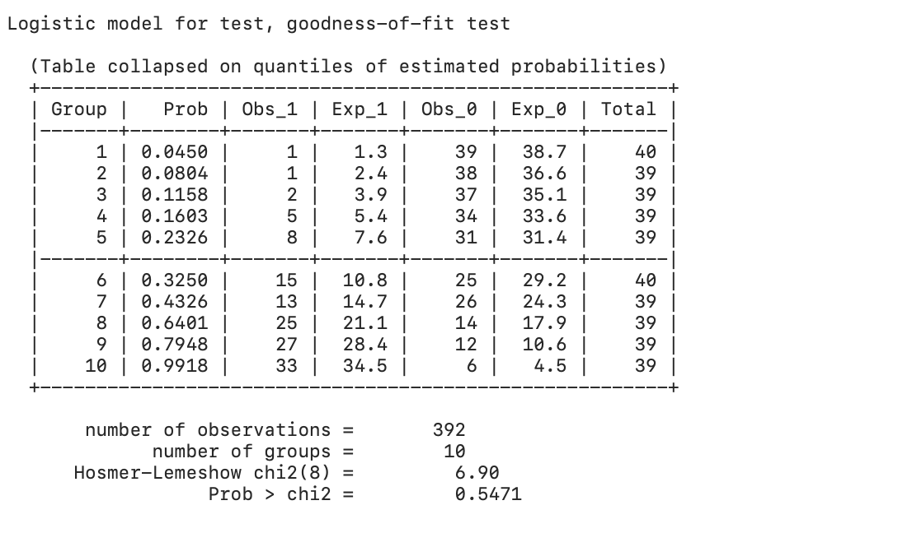 
```
  
Since the p-value is greater than $\alpha = 0.05$, we fail to reject the null hypothesis
that the observed and expected proportions are the same across all groups. We can conclude that the observed and expected proportions are equal, meaning that the model 
selected is a good fit. 

**Confusion Matrix**

To determine the accuracy of our model, we can generate a classification report
using the following command:
```
estat classification
```
  
```{r, out.width = "60%", echo=FALSE}
library(knitr)
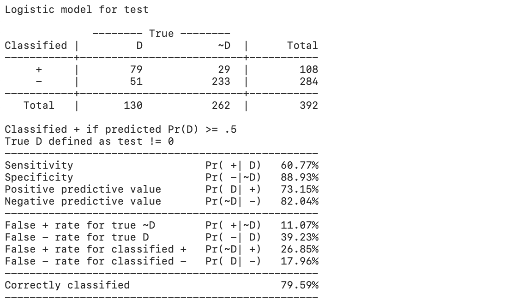 
```

The results show 79.59% correctly classified observations.

**Reciever Operating Characteristic (ROC) Curve**

These results, specifically the False Positive Rate and True Positive Rate
can be plotted on a Receiving Operator Characteristic (ROC) Curve using 
the following command:
```
lroc, title("Receiving Operator Characteristic Curve") xtitle("False Positive Rate") ytitle("True Positive Rate")
```

```{r, out.width = "60%", fig.cap = "ROC Curve", echo=FALSE}
library(knitr)
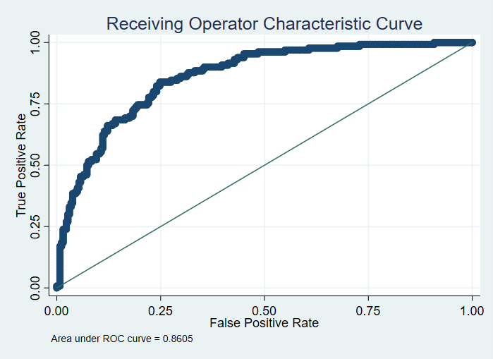 
```
  
```{r, out.width = "60%", echo=FALSE}
library(knitr)
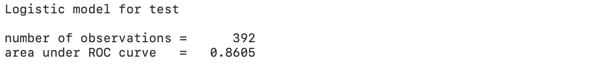 
```

We get an area under the ROC curve of 0.8605, which is close to 1.00, indicative of
good model accuracy.

**Summary**

In this tutorial we illustrated how to implement logistic regression, select a model
and conduct model diagnostics. 

**References**

- https://en.wikipedia.org/wiki/Receiver_operating_characteristic#Area_under_the_curve
- https://www.sealedenvelope.com/stata/hl/
- https://en.wikipedia.org/wiki/Hosmer%E2%80%93Lemeshow_test

  
  
