The goal of this tutorial is to demonstrate the use of Logistic Regression, and model diagnostics for this type of regression. We will start this tutorial by explaining the algorithm and the modeling behind Logistic regression. This would be followed by an illustrative example using three statistical software languages: Python, R, and STATA.

## Algorithm
Logistic regression is a predictive modelling algorithm that is used when the response variable $y$ is binary categorical variable, i.e. $y$ can only take two values: 0 and 1. It is defined by the probability mass function:
$$P(y_i=1|x_i=x) = \frac{exp(\beta'x)}{1+exp(\beta'x)}$$
which implys that 
$$P(y_i=0|x_i=x) = \frac{1}{1+exp(\beta'x)}$$

In logistic regression, the logit function is $logit(x) = log \frac{x}{1-x}$ and expit function is the inverse of logit function, $expit(x) = \frac{exp(x)}{1+exp(x)}$. Logit function maps unit interval onto real line and expit function does the inverse job. Here, in logistic regression, the logit function maps $\beta'x$ to a probablity. As a result, the linear predictor $\beta'x$ can be interpreted in logistic regression as the conditional log odds: 
$$log \frac{P(y_i=1|x_i=x)}{P(y_i=0|x_i=x)} = \beta'x$$

### Model Selection with Backwards Elimination and the Bayesian Information Criterion


### Performance Measurement with the Receiver Operating Characteristic (ROC) Curve


### Goodness of Fit Test with the Hosmer-Lemeshow Statistic
The Hosmer-Lemeshow Test is a goodness-of-fit test used for logistic regression models. It maps the expected probabilities against the actual observations by subgroups of the model population. The null hypothesis for the test is that the expected proportions from the model are the same as those observed across all subgroups. The alternative hypothesis is that the observed and expected proportions are not the same. 

The Hosmer-Lemeshow statistic is given by:

$$
H = \sum_{g=1}^G\frac{(O_{1g}-E_{1g})^2}{N_g\pi_g(1-\pi_g)}
$$
Where $O_{1g}$, $E_{1g}$, $N_g$, and $\pi_g$ denote the observed Y=1 events, expected Y=1 events, total observations, predicted risk for the $g$th risk decile group, and $G$ is the number of groups. 

We then compare this test statistic to the $\chi ^{2}$ distribution with $G − 2$ degrees of freedom to calculate for the p-value of the test. A high p-value would mean that we would fail to reject the null hypothesis. This means that the model generates fitted values equal 
to observed values, indicating a good fit. 


## Data Summary

In this tutorial, we work on the `pima` dataset from the package `faraway v1.0.7` in R, which has 9 variables. The data comes from a National Institute of Diabetes and Digestive and Kidney Diseases study on 768 adult female Pima Indians living near Phoenix. Different measurements of the subjects were taken and the following variables were recorded: Number of times pregnant ("pregnant"), Plasma glucose concentration, which is the result of a 2 hours oral glucose tolerance test ("glucose"), Diastolic blood pressure (mm Hg) ("diastolic"), Triceps skin fold thickness (mm) ("triceps"), 2-Hour serum insulin (mu U/ml) ("insulin"), Body mass index (weight in kg/(height in m2)) ("bmi"), Diabetes pedigree function ("diabetes"), Age (years) ("age") and a test whether the patient shows signs of diabetes ("test"), coded 0 if negative, 1 if positive. 

Since this dataset contains a binary categorical variable ("test"), logistic regression can be used to create a predictive model using the rest of the variables as predictors to determine the probability that a person will show positive signs of diabetes. 

## Languages {.tabset}

### R

In order to run this analysis in R, we need to install two key packages: "Faraway" and "ResourceSelection" The former is required to access the data used in this illustration and the latter is used to run the model diagnostics. Once installed with the command, install.packages("packagename"), they can be loaded using library( ).

#### Loading Dataframe and Numerical Summaries

Once the dataframe "pima" is loaded, we can view the summaries of the variables by using the function, summary.

```{r pima}
library(faraway)
data(pima)
summary(pima)
```

The variables: "diastolic", "insulin", "glucose" and "bmi" exhibit zero values, since that is not physically possible we conclude that these are measurement errors or missing values might have been coded as 0. In an attempt to clean up the data, we remove these values.

```{r message = FALSE}
library(dplyr)
pima_clean = filter(pima, diastolic > 0 & bmi > 0) %>% filter(insulin > 0 & glucose > 0)
summary(pima_clean)
```

#### Model Selection using the Backward Elimination Method

We use the Backward elimination method to select the model specification, with the BIC as a guide. Please note that a lower BIC indicates improved fit of the model. So, we will be focusing on the individual p-values for the variables and the BIC for the model. 

We start with a logistic model with "test" as the response variable and all the other variables as explanatory. The variable test is binary i.e. takes the value 0 and 1. We term a positive diatebetes detection as a "success" (test = 1) and the negative detection as a "failure" (test = 0).
```{r logisticmodel}
Fit = glm(test~ ., family = binomial(link="logit"), data = pima_clean)
summary(Fit)
BIC(Fit)
```
The stepwise elimination of variables that are individually statistically insignificant and using the BIC criterion, results in the final model specification with four independent variables: age, bmi, glucose, and diabetes.
```{r finalmodel}
Fit_final = glm(test~ glucose+bmi+diabetes+age, family = binomial(link="logit"), data = pima_clean)
summary(Fit_final)
BIC(Fit_final)
```
The estimated coefficients indicate the change in the log odds of the response when the predictors change by one unit. For example, the log odds of testing positive for diabetes increases by 0.053 when age increases by one unit. In addition, we can obtain the confidence intervals for the coefficient estimates as given below (Note, that these confidence intervals are based on the standard errors and rely on the normality assumption).
```{r message = FALSE}
#computing confidence intervals:
confint(Fit_final)
```

#### Hosmer-Lemeshow Goodness of Fit Test

We apply the Hosmer-Lemeshow test to assess the fit of the model. Essentially, we are testing the null hypothesis that the specified logistic regression model is the correct model. Since the p-value is high, we fail to reject the null hypothesis.
```{r message = FALSE}
library(ResourceSelection)
h1 = hoslem.test(Fit_final$y, fitted(Fit_final), g = 10)
h1
```

In addition, the Hosmer–Lemeshow test specifically identifies subgroups as the deciles of fitted probability values. Models for which the expected and observed probabilities in subgroups are similar are considered to be well calibrated. This provides evidence that our model is well calibrated.

```{r HL1}
library(ResourceSelection)
#inspect the expected and observed values
h2 = cbind(h1$expected, h1$observed)
h2
```

#### Confusion Matrix

This provides us with another tool to evaluate the model. It gives us a measure of the Type 1 and Type 2 error in our modeling. The diagonal gives the count of the instances when our model predicts correctly. Inspecting the Confusion matrix for our model we deduce that the overall predicted accurancy for our model is around 80 percent. 
```{r CM}
p = predict(Fit_final, pima_clean, type = "response")
Con_table = table(p > 0.5, pima_clean$test)
Con_table
```

#### Reciever Operating Characteristic (ROC) Curve

Finally, we inspect the ROC curve. This curve plots the false positive rate against the true probablistic prediction for a range of threshold probabilities. The area under the curve is viewed as a measure of prediction accuracy. The larger the area under the curve, and hence the farther away the ROC curve is from the diagonal, the better the model performance. Computing the area under the curve (AUC) allows us to quantitatively evaluate the model performance. This could serve as a useful tool for model comparision as well.


```{r roc, message = FALSE}
library(ROCR)
p = predict(Fit_final, pima_clean, type = "response")
pred = prediction(p, pima_clean$test)
roc = performance(pred, "tpr", "fpr")
plot(roc, col = 'red',
     main = "ROC Curve")
abline(a=0, b=1)
#Higher area under the curve the better the fit (AUC)
auc = performance(pred, "auc")
auc = unlist(slot(auc, "y.values"))
auc = round(auc, 2)
legend(.6, .2, auc, title = "Area under the Curve", cex = .75)
```

#### Summary
In this tutorial we illustrated how to implement logistic regression and conduct model diagnostics. We used the "pima" dataset to study how the diabetes detection indicator is associated to variables, such as: age, bmi, glucose and the Diabetes pedigree score of women belonging to a Native Indian tribe. We used the Backward Elimination method to decide on the model specification for the logistic regression model. In order to assess the fit of our model we employed techniques such the Hosmer-Lemeshow Test and the ROC Curve, which led us to the conclusion that our model specification is a good fit for these data and hence our findings are meaningful.

#### References

Hosmer, D. & Lemeshow, S. (2000). Applied Logistic Regression (Second Edition). New York: John Wiley & Sons, Inc.
UCLA Institute for Digital Research and Education website: https://stats.idre.ucla.edu/r/dae/logit-regression/


### Python 

This page uses the following packages in python. Please make sure that you can load them before trying to run the examples on this page.

```{r eval=FALSE}
import pandas as pd                                ## data analysis package
import matplotlib.pyplot as plt                    ## plot package
import warnings
warnings.filterwarnings("ignore")                
import statsmodels.formula.api as smf             
import statsmodels.api as sm                       ## statistical model package
from sklearn.metrics import confusion_matrix       ## logistic regression report packages
from sklearn.metrics import roc_auc_score
from sklearn.metrics import roc_curve
from sklearn.metrics import classification_report
from scipy.stats import chi2                       ## chi-square 
```

#### Loading Dataframe and Numerical Summaries

In this tutorial, we use pima data as our datasets. In order to fit package in python. We first divide our model into dependent variable and independent variables. Besides, since all independent variables here are numeric, we do not need to change them into factor. However, when utilizing `sm.Logit()` in python, it doesn't include intercept, so we add a new column named intercept in the independent variable. The code is as following:

```{r eval=FALSE}
## Load data
data=pd.read_csv("pima.txt",
   delim_whitespace=True,
   skipinitialspace=True)
data['intercept'] = 1.0
```

Once the dataframe `pima` is loaded, we can view the summaries of the variables by using the function in python, $data.describe()$.

```{r eval=FALSE}
## Summary of data
pd.set_option('display.max_columns', None)
describe = data.describe()
print(describe)
```

```{r fig_summary2, echo=FALSE, out.width = "500px", fig.cap = "data summary before data cleaning", fig.align = 'center'}
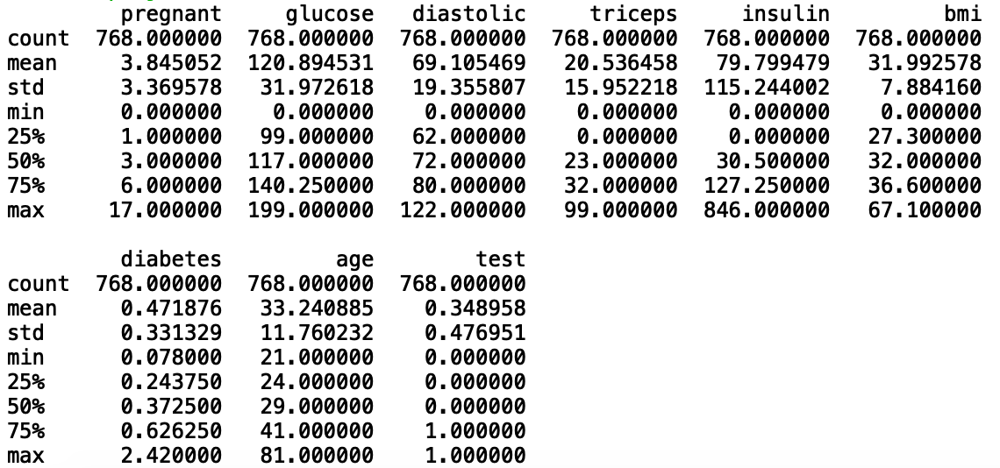
```

Then we clean the rows whose `bmi`, `diastolic`, `glucose`, `triceps` and `insulin` equals 0 with following code:
```{r eval=FALSE}
## Data Cleaning
data = data[data['bmi']>0]
data = data[data['diastolic']>0]
data = data[data['glucose']>0]
data = data[data['triceps']>0]
data = data[data['insulin']>0]
y=data['test']
X=data.drop(['test'], axis=1)
```

After do the data cleaning, we have the result as following:

```{r eval=FALSE}
## Summary of data after data cleaning
describe = data.describe()
print(describe)
```

```{r fig_summary1, echo=FALSE, out.width = "500px", fig.cap = "data summary before data cleaning", fig.align = 'center'}
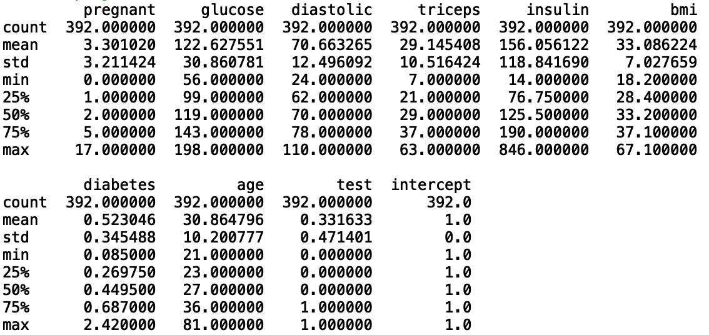
```

#### Model Selection Using the Backward Elimination Method

We first use a logistic model with `test` as the response variable and all the other variables as explanatory.

```{r eval=FALSE}
## Logistic regression
logit_model=sm.Logit(y,X)
result=logit_model.fit()
print(result.summary2())
```

```{r fig_1, echo=FALSE, out.width = "500px", fig.cap = "Logistic regression", fig.align = 'center'}
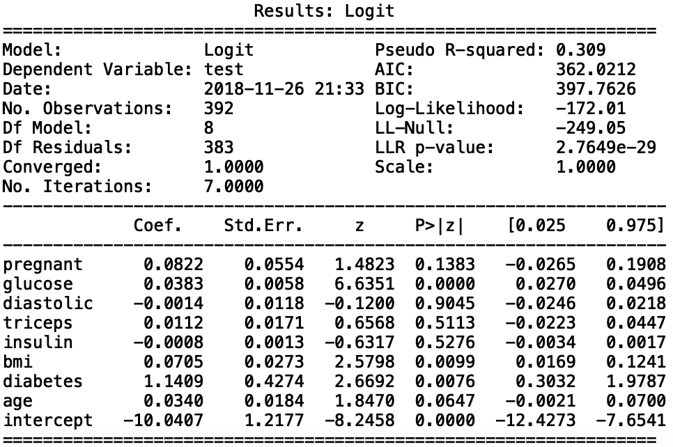
```

In the output above, we can gain the estimated coefficients, standard error, confidence interval of coefficients, z-value (Wald z-statistic) and its corresponding p-values. Here, we can find that variable `pregnant`, `glucose`, `bmi`, `diabete`, `intercept` are all statistically significant, while `triceps`, `insulin`, `age`, `diastolic` are not. The result above can be interpreted as following:

$$ log \frac{p}{1-p} =-10.04+ 0.082\times pregnant+ 0.038 \times glucose  -0.001 \times diastolic +0.011 \times triceps -0.0008 \times insulin +  0.071 \times bmi+ 1.141  \times diabetes +0.034 \times age $$


Backward stepwise with BIC criterion, which involves starting with all candidate variables, testing the deletion of each variable using a chosen model fit criterion, deleting the variable (if any) whose loss gives the most BIC deterioration of the model fit, and repeating this process until no further variables can be deleted without a BIC loss of fit.

There is no built-in method for choosing a regression model by forward selection. So we try to compare change in BIC when deleting each feature and we have the result as following

```{r eval=FALSE}
## Backward stepwise with BIC
# Triceps individually highly insignificant so drop the variable and assess the model
X1=X.drop(['triceps'], axis=1)
logit_model1=sm.Logit(y,X1)
result1=logit_model1.fit()
print(result1.bic)
```

```{r fig_2, echo=FALSE, out.width = "350px", fig.cap = "BIC after deleting triceps", fig.align = 'center'}
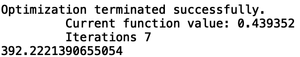
```

The BIC of original model is 398, after deleting `triceps`, BIC declines to 392. We follow the same step and delete `diastolic` and have the result as following:

```{r eval=FALSE}
# Drop diastolic (individually statistically insignificant) and assess the model
X2=X.drop(['triceps','diastolic'], axis=1)
logit_model2=sm.Logit(y,X2)
result2=logit_model2.fit()
print(result2.bic)
```

```{r fig_3, echo=FALSE, out.width = "350px", fig.cap = "BIC after deleting triceps and diastolic", fig.align = 'center'}
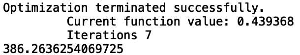
```
After deleting `diastolic`, BIC declines to 386. We follow the same step and delete `insulin` and have the result as following:

```{r eval=FALSE}
# Drop insulin (indiviadually insignificant) and assess the model
X3=X.drop(['triceps','diastolic','insulin'], axis=1)
logit_model3=sm.Logit(y,X3)
result3=logit_model3.fit()
print(result3.bic)
```

```{r fig_4, echo=FALSE, out.width = "350px", fig.cap = "BIC after deleting triceps, diastolic and insulin", fig.align = 'center'}
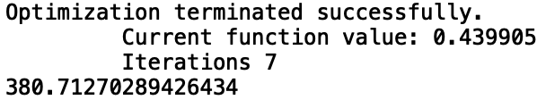
```

After deleting `insulin`, BIC declines to 381. We now follow the same step and delete `pregnant` and finally have the model as:

```{r eval=FALSE}
# Drop age (indiviadually insignificant) and assess the model
X4=X.drop(['triceps','diastolic','insulin', 'age'], axis=1)
logit_model4=sm.Logit(y,X4)
result4=logit_model4.fit()
print(result4.summary2())
```

```{r fig_5, echo=FALSE, out.width = "500px", fig.cap = "Logistic regression", fig.align = 'center'}
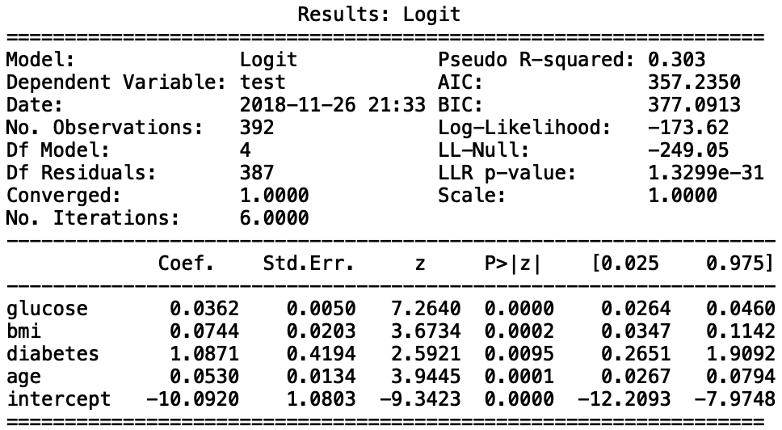
```

We can find that the final model only contain 4 variables and intercept. All of them are statistically significant. The result above can be interpreted as following:
$$log \frac{p}{1-p} =-10.092+ 0.036 \times glucose+  0.074 \times bmi+ 1.087 \times diabetes +0.053 \times age$$

#### Model Fitting

In this part, we fit model with the model we derived in the last part. 

```{r eval=FALSE}
# Fitting value
y_prob = result4.predict(X4)
```

We first calculate the accuracy of our classification model:
```{r eval=FALSE}
## Test accuracy
pred = result4.predict(X4)
pred[pred > 0.5] = 1
pred[pred <= 0.5] = 0
test_acc = (y == pred).mean()
print('Accuracy of logistic regression classifier on test set: {:.2f}'.format(test_acc))
```

```{r fig_6, echo=FALSE, out.width = "500px", fig.align = 'center'}

```

#### Hosmer-Lemeshow Goodness of Fit Test


The Hosmer-Lemeshow Test is a goodness-of-fit test for logistic regression 
models. It maps the expected probabilities against the actual observations by 
subgroups of the model population. The null hypothesis for the test  is that 
the observed and expected proportions are the same across all doses. The 
alternative hypothesis is that the observed and expected proportions are not 
the same.

The Hosmer-Lemeshow statistic is given by:

$$
H = \sum_{g=1}^G\frac{(O_{1g}-E_{1g})^2}{N_g\pi_g(1-\pi_g)}
$$
Where $O_{1g}$, $E_{1g}$, $N_g$, and $\pi_g$ denote the observed Y=1 events, expected Y=1 events, total observations, predicted risk for the $g$th risk decile group, and $G$ is the number of groups. We then compare this test statistic to the $\chi ^{2}$ distribution with $G-2$ degrees of freedom to calculate for the p-value of the test.

```{r eval=FALSE}
# Hoslem-Lemeshow Test
y_prob = pd.DataFrame(y_prob)
y_prob1 = pd.concat([y_prob, y], axis =1)
y_prob1['decile'] = pd.qcut(y_prob1[0], 10)
obsevents_pos = y_prob1['test'].groupby(y_prob1.decile).sum()
obsevents_neg = y_prob1[0].groupby(y_prob1.decile).count() - obsevents_pos
expevents_pos = y_prob1[0].groupby(y_prob1.decile).sum()
expevents_neg = y_prob1[0].groupby(y_prob1.decile).count() - expevents_pos
hl = ((obsevents_neg - expevents_neg)**2/expevents_neg).sum()+((obsevents_pos - expevents_pos)**2/expevents_pos).sum()
print('chi-square: {:.2f}'.format(hl))
## df = group-2
pvalue=1-chi2.cdf(hl,8)
print('p-value: {:.2f}'.format(pvalue))
obsevents_pos = pd.DataFrame(obsevents_pos)
obsevents_neg = pd.DataFrame(obsevents_neg)
expevents_pos = pd.DataFrame(expevents_pos)
expevents_neg = pd.DataFrame(expevents_neg)
final = pd.concat([obsevents_pos, obsevents_neg, expevents_pos, expevents_neg], axis =1)
final.columns=['obs_pos','obs_neg','exp_pos', 'exp_neg']
print(final)
```

The observed number of successes and failures in each interval are obtained by counting the subjects in that interval. The expected number of successes in an interval is the sum of the probability of success for the subjects in that interval.

```{r fig_10, echo=FALSE, out.width = "500px",fig.cap = "Table of observed and expected counts", fig.align = 'center'}
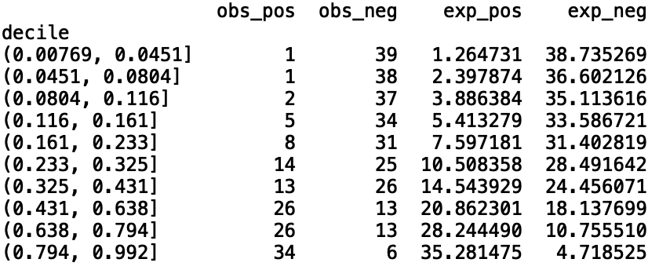
```

The Hosmer-Lemeshow statistic is calculated from above table and we final calculate p-value as following:

```{r fig_11, echo=FALSE, out.width = "150px",fig.align = 'center'}
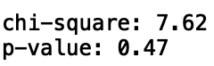
```

#### Confusion Matrix

```{r eval=FALSE}
# Confusion matrix
confusion_matrix = confusion_matrix(y, pred)
print(confusion_matrix)
```

```{r fig_7, echo=FALSE, out.width = "100px", fig.align = 'center'}
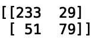
```
The (1,1) entry means real value equals 1 and predict value equals 1. The (1,2) entry means real value equals 1 and predict value equals 0. The (2,1) entry means real value equals 0 and predict value equals 1. The (2,2) entry means real value equals 0 and predict value equals 0. Thus, we have 233+79 correct predictions and 51+29 false predictions.

#### Classification Report

```{r eval=FALSE}
# classification report
print(classification_report(y, pred))
```

```{r fig_8, echo=FALSE, out.width = "500px",fig.cap = "classification report", fig.align = 'center'}
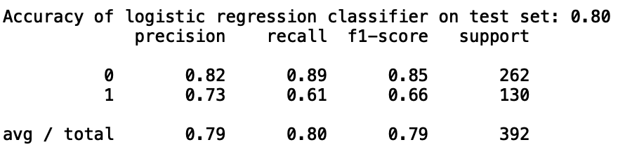
```
#### Reciever Operating Characteristic (ROC) Curve

When the prediction effect is good, the ROC curve is convex to the apex of the upper left corner. The diagonal line in the translation is tangent to the ROC curve to obtain a point where the TPR is large and the FPR is small. The better the model effect, the farther away the ROC curve is from the diagonal. In the extreme case, the ROC curve passes through the (0,1) point, that is, the positive example is all positive and the negative example is all negative. Under the ROC curve The area can quantitatively evaluate the effect of the model, which is recorded as AUC. The larger the AUC, the better the model effect.

```{r, eval=FALSE}
# ROC curve
logit_roc_auc = roc_auc_score(y, pred)
fpr, tpr, thresholds = roc_curve(y, y_prob)
plt.figure()
plt.plot(fpr, tpr, label='Logistic Regression (area = %0.2f)' % logit_roc_auc)
plt.plot([0, 1], [0, 1],'r--')
plt.xlim([0.0, 1.0])
plt.ylim([0.0, 1.05])
plt.xlabel('False Positive Rate')
plt.ylabel('True Positive Rate')
plt.title('Receiver operating characteristic')
plt.legend(loc="lower right")
plt.savefig('Log_ROC')
plt.show()
```

```{r fig_9, echo=FALSE, out.width = "500px",fig.cap = "classification report", fig.align = 'center'}
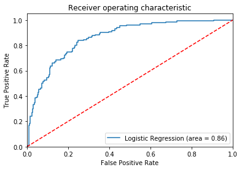
```

#### Summary
In this tutorial we illustrated how to implement logistic regression, select a model
and conduct model diagnostics in python. 

#### References
- https://towardsdatascience.com/building-a-logistic-regression-in-python-step-by-step-becd4d56c9c8
- https://www.data-essential.com/hosman-lemeshow-in-python/
- https://en.wikipedia.org/wiki/Logistic_regression 


### STATA

For Stata, all functions for the tests in this tutorials are built-in, 
so there is no need to install or load any additional packages prior
to performing the analysis in this tutorial. 

#### Loading Dataset and Numerical Summaries

The data set was exported from R into a comma-separated variable file 
`pima.csv`. We can import and summarize the pima dataset from a CSV 
file using the following:

```
import delimited using pima.txt, clear
summarize
```

```{r, out.width = "60%", echo=FALSE}
library(knitr)
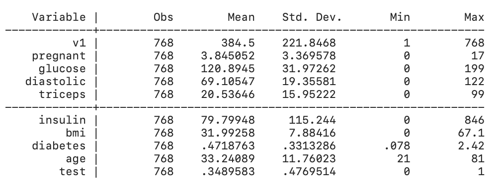 
```

We see from the summary that the data for `bmi`, `diastolic`, `glucose`, and 
`triceps` contain 0 values, which are not possible measures of these
parameters. We must therefore clear rows with these values from our dataset.
We can do this as follows:

```
drop if glucose == 0 | diastolic == 0 | triceps ==0 | insulin == 0 | bmi == 0
summarize 
``` 

```{r, out.width = "60%", echo=FALSE}
library(knitr)
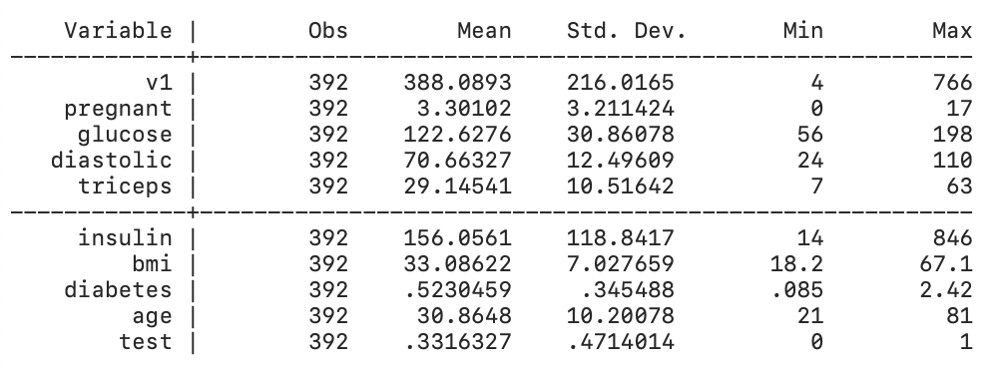 
```


We can see that we now have 392 observations from the initial 768, and
all values are now within reasonable range. 

#### Model Selection using the Backward Elimination method

For this model, our response variable is `test` which indicates whether
or not a patient tested positive for diabetes. Note that the rest of the 
variables are numeric and continuous, so we can use them as-is in our
regression model. Using all other variables as independent variables,
we can generate the full model using this code:

```
logit test pregnant glucose diastolic triceps insulin bmi diabetes age
```

```{r, out.width = "60%", echo=FALSE}
library(knitr)
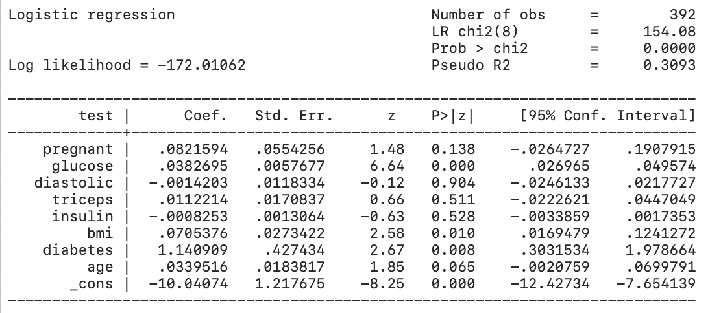 
```


We now want to determine the best fit model for the given data. Starting with the
full model, we use backward elimination to drop variables one-by-one and the
Bayesian Information Criterion (BIC) to determine if the model is an improvement
from the previous model. 
  
We first get the BIC of the model using the following command: 
```
estat ic
```

```{r, out.width = "60%", echo=FALSE}
library(knitr)
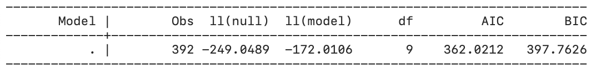 
```

To determine the order at which to drop the variables, we can use Stata's `stepwise`
function using a 95% confidence level. 
```
stepwise, pr(0.05): logit test pregnant glucose diastolic triceps insulin bmi diabetes age
```

```{r, out.width = "60%", echo=FALSE}
library(knitr)
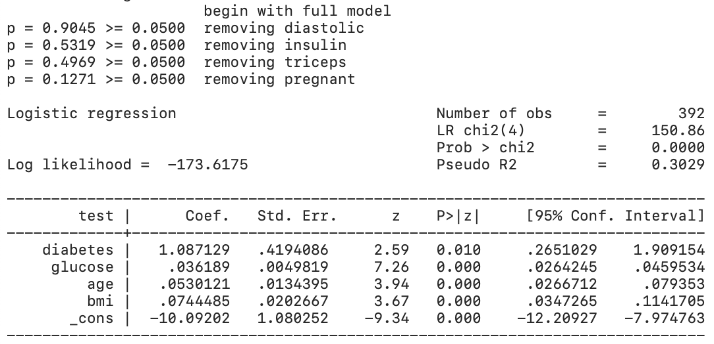 
```
  
From this, we get the dropping order `diastolic`, `insulin`, `triceps`, `pregnant`.

First, we drop `diastolic`:
```
// Model 1 (drop diastolic):
quietly logit test pregnant glucose triceps insulin bmi diabetes age
estat ic
```

```{r, out.width = "60%", echo=FALSE}
library(knitr)
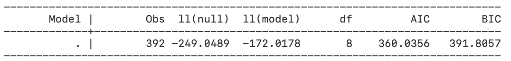 
```

From this, we get a BIC of 391.8057, an improvement from the full model. 
We then drop `insulin`:

```
// Model 2 (drop insulin):
quietly logit test pregnant glucose triceps bmi diabetes age
estat ic
```

```{r, out.width = "60%", echo=FALSE}
library(knitr)
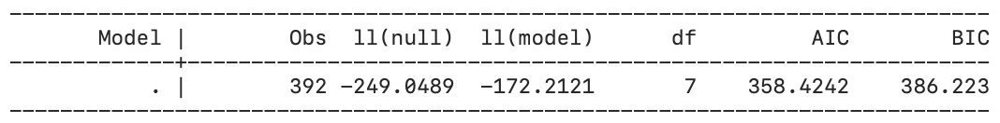 
```

Our BIC is now 386.223. Dropping the variable `triceps`, we get another
model iteration:
```
// Model 3 (drop triceps): 
quietly logit test pregnant glucose bmi diabetes age
estat ic
```

```{r, out.width = "60%", echo=FALSE}
library(knitr)
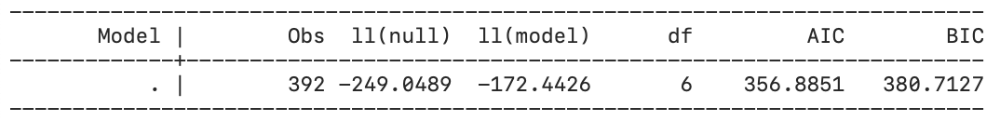 
```

This gives us a BIC of 380.7127, still an improvement from the previous.
Lastly, dropping `pregnant`, we use the following code and get the
model summary:

```
// Model 4 (drop pregnant): 
logit test glucose bmi diabetes age
estat ic
```

```{r, out.width = "60%", echo=FALSE}
library(knitr)
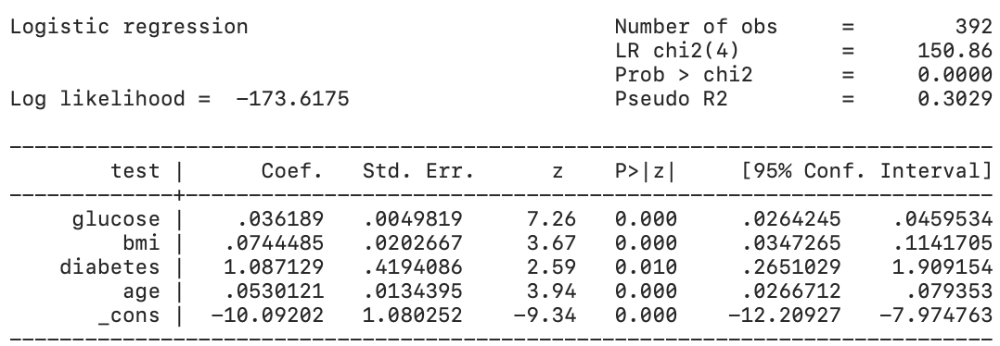 
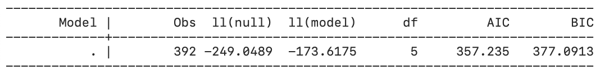 
```

We see that all variables are now signifcant and we get a minimized BIC of 
377.0913 for this model. 

Now that we have a final model, we can create a new column `p` which contains
the fitted values of our model using the following command:

``` 
predict p
```

#### Hosmer-Lemeshow Goodness of Fit Test
We use the Hosmer-Lemeshow test to assess the goodness-of-fit of the model. Our null hypothesis is that the fitted values from the model are the same as what is observed. 

We group the data into deciles and perform the Hosmer-Lemeshow Test using the following code:

```
estat gof, group(10) table
```
   
     
```{r, out.width = "60%", echo=FALSE}
library(knitr)
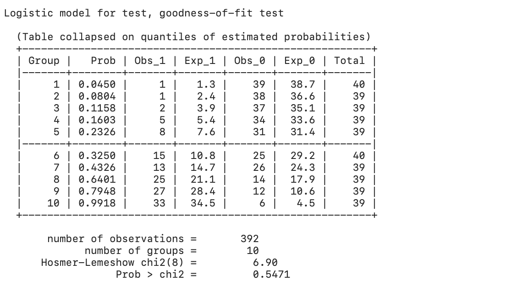 
```
  
Since the p-value is greater than $\alpha = 0.05$, we fail to reject the null hypothesis
that the observed and expected proportions are the same across all groups. We can conclude that the observed and expected proportions are equal, meaning that the model 
selected is a good fit. 

#### Confusion Matrix

To determine the accuracy of our model, we can generate a classification report
using the following command:
```
estat classification
```
  
```{r, out.width = "60%", echo=FALSE}
library(knitr)
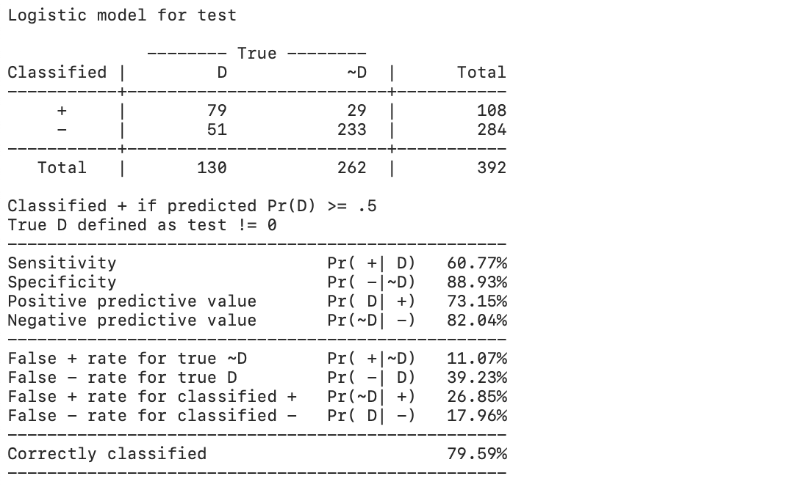 
```

The results show 79.59% correctly classified observations.

#### Reciever Operating Characteristic (ROC) Curve

These results, specifically the False Positive Rate and True Positive Rate
can be plotted on a Receiving Operator Characteristic (ROC) Curve using 
the following command:
```
lroc, title("Receiving Operator Characteristic Curve") xtitle("False Positive Rate") ytitle("True Positive Rate")
```

```{r, out.width = "60%", fig.cap = "ROC Curve", echo=FALSE}
library(knitr)
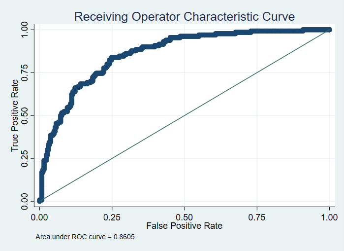 
```
  
```{r, out.width = "60%", echo=FALSE}
library(knitr)
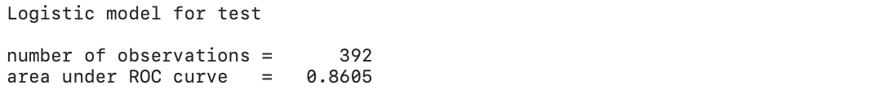 
```

We get an area under the ROC curve of 0.8605, which is close to 1.00, indicative of
good model accuracy.

#### Summary

In this tutorial we illustrated how to implement logistic regression, select a model
and conduct model diagnostics. 

#### References

- https://en.wikipedia.org/wiki/Receiver_operating_characteristic#Area_under_the_curve
- https://en.wikipedia.org/wiki/Hosmer%E2%80%93Lemeshow_test

  
  
