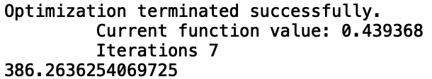
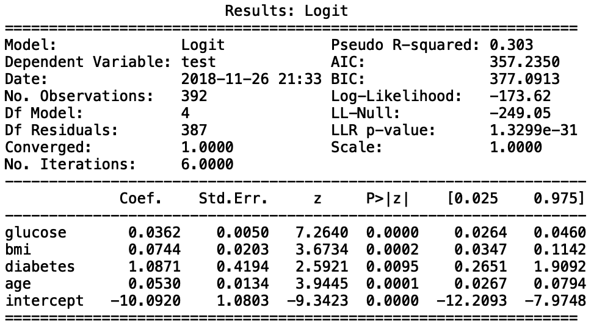
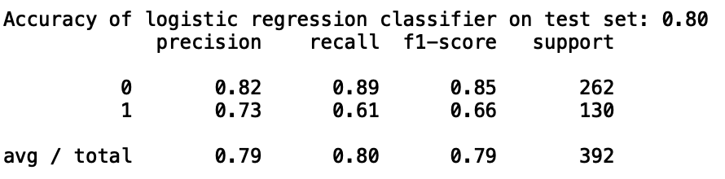

The goal of this tutorial is to demostrate the use of Logistic Regression, and model 
diagnostics for this type of regression. We will start this tutorial by explaining 
the algorithm and the modeling behind Logistic regression. This would be followed by 
an illustrative example using three statistical software languages: Python, R, and STATA.

###Algorithm
Logistic regression is a predictive modelling algorithm that is used when the response 
variable is binary categorical variable, i.e. it can only take two values: 0 and 1. 

###Data Summary
In this tutorial, we work on the `pima` dataset from `faraway v1.0.7` in R, 
which has 9 variables. The data comes from a National Institute of Diabetes and 
Digestive and Kidney Diseases study on 768 adult female Pima Indians living near Phoenix.
Different measurements of the subjects were taken and it was recorded whether or not
the patient showed signs of diabetes. More information on the data can be found
[here](https://www.rdocumentation.org/packages/faraway/versions/1.0.7/topics/pima).

##Languages {.tabset}

###R

###Python 

This page uses the following packages in python. Please make sure that you can load them before trying to run the examples on this page.

```{r eval=FALSE}
import pandas as pd
import matplotlib.pyplot as plt 
import warnings
warnings.filterwarnings("ignore")
import statsmodels.formula.api as smf
import statsmodels.api as sm
from sklearn.linear_model import LogisticRegression
from sklearn.metrics import confusion_matrix
from sklearn.metrics import roc_auc_score
from sklearn.metrics import roc_curve
from sklearn.metrics import classification_report
from scipy.stats import chi2
```

## Importing Data and Data Cleaning

In this tutorial, we use pima data as our datasets. In order to fit package in python. We first divide our model into dependent variable and independent variables. Besides, since all independent variables here are numeric, we do not need to change them into factor. However, when utilizing $sm.Logit()$ in python, it doesn't include intercept, so we add a new column named intercept in the independent variable. The code is as following:

```{r eval=FALSE}
data=pd.read_csv("pima.txt",
   delim_whitespace=True,
   skipinitialspace=True)
data['intercept'] = 1.0
```

Then we clean the rows whose $bmi$, $diastolic$, $glucose$, $triceps$ and $insulin$ equals 0 with following code:
```{r eval=FALSE}
## Data Cleaning
data = data[data['bmi']>0]
data = data[data['diastolic']>0]
data = data[data['glucose']>0]
data = data[data['triceps']>0]
data = data[data['insulin']>0]
y=data['test']
X=data.drop(['test'], axis=1)
```

## Inplement of Logistic Model

```{r eval=FALSE}
logit_model=sm.Logit(y,X)
result=logit_model.fit()
print(result.summary2())
```

```{r fig_1, echo=FALSE, out.width = "500px", fig.cap = "Logistic regression", fig.align = 'center'}
knitr::include_graphics("./fig_py/fit1.png")
```

In the output above, we can gain the estimated coefficients, standard error, confidence interval of coefficients, z-value (Wald z-statistic) and its corresponding p-values. Here, we can find that variable $pregnant$, $glucose$, $bmi$, $diabetes$, $intercept$ are all statistically significant, while $triceps$, $insulin$, $age$, $diastolic$ are not. The result above can be interpreted as following:

$$ log \frac{p}{1-p} =-10.04+ 0.082\times pregnant+ 0.038 \times glucose  -0.001 \times diastolic +0.011 \times triceps -0.0008 \times insulin +  0.071 \times bmi+ 1.141  \times diabetes +0.034 \times age $$

## Backward Stepwise with BIC

Backward stepwise with BIC criterion, which involves starting with all candidate variables, testing the deletion of each variable using a chosen model fit criterion, deleting the variable (if any) whose loss gives the most BIC deterioration of the model fit, and repeating this process until no further variables can be deleted without a BIC loss of fit.

There is no built-in method for choosing a regression model by forward selection. So we try to compare change in BIC when deleting each feature and we have the result as following

```{r eval=FALSE}
## Backward stepwise with BIC
# Triceps individually highly insignificant so drop the variable and assess the model
X1=X.drop(['triceps'], axis=1)
logit_model1=sm.Logit(y,X1)
result1=logit_model1.fit()
print(result1.bic)
```

```{r fig_2, echo=FALSE, out.width = "350px", fig.cap = "BIC after deleting triceps", fig.align = 'center'}
knitr::include_graphics("./fig_py/fit2bic.png")
```

The BIC of original model is 398, after deleting $triceps$, BIC declines to 392. We follow the same step and delete $diastolic$ and have the result as following:

```{r eval=FALSE}
# Drop diastolic (individually statistically insignificant) and assess the model
X2=X.drop(['triceps','diastolic'], axis=1)
logit_model2=sm.Logit(y,X2)
result2=logit_model2.fit()
print(result2.bic)
```

```{r fig_3, echo=FALSE, out.width = "350px", fig.cap = "BIC after deleting triceps and diastolic", fig.align = 'center'}

```
After deleting $diastolic$, BIC declines to 386. We follow the same step and delete $insulin$ and have the result as following:

```{r eval=FALSE}
# Drop insulin (indiviadually insignificant) and assess the model
X3=X.drop(['triceps','diastolic','insulin'], axis=1)
logit_model3=sm.Logit(y,X3)
result3=logit_model3.fit()
print(result3.bic)
```

```{r fig_4, echo=FALSE, out.width = "350px", fig.cap = "BIC after deleting triceps, diastolic and insulin", fig.align = 'center'}
knitr::include_graphics("./fig_py/fit4bic.png")
```

After deleting $insulin$, BIC declines to 381. We now follow the same step and delete $pregnant$ and finally have the model as:

```{r eval=FALSE}
# Drop age (indiviadually insignificant) and assess the model
X4=X.drop(['triceps','diastolic','insulin', 'age'], axis=1)
logit_model4=sm.Logit(y,X4)
result4=logit_model4.fit()
print(result4.summary2())
```

```{r fig_5, echo=FALSE, out.width = "500px", fig.cap = "Logistic regression", fig.align = 'center'}

```

We can find that the final model only contain 4 variables and intercept. All of them are statistically significant. The result above can be interpreted as following:
$$log \frac{p}{1-p} =-10.092+ 0.036 \times glucose+  0.074 \times bmi+ 1.087 \times diabetes +0.053 \times age$$

## Model Fitting

In this part, we fit model with the model we derived in the last part. 

```{r eval=FALSE}
# Fitting value
y_prob = result4.predict(X4)
```

We first calculate the accuracy of our classification model:
```{r eval=FALSE}
## Test accuracy
pred = result4.predict(X4)
pred[pred > 0.5] = 1
pred[pred <= 0.5] = 0
test_acc = (y == pred).mean()
print('Accuracy of logistic regression classifier on test set: {:.2f}'.format(test_acc))
```

```{r fig_6, echo=FALSE, out.width = "500px", fig.align = 'center'}
knitr::include_graphics("./fig_py/fig3.png")
```

## Confusion Matrix

```{r eval=FALSE}
# Confusion matrix
confusion_matrix = confusion_matrix(y, pred)
print(confusion_matrix)
```

```{r fig_7, echo=FALSE, out.width = "100px", fig.align = 'center'}
knitr::include_graphics("./fig_py/fig2.png")
```
The (1,1) entry means real value equals 1 and predict value equals 1. The (1,2) entry means real value equals 1 and predict value equals 0. The (2,1) entry means real value equals 0 and predict value equals 1. The (2,2) entry means real value equals 0 and predict value equals 0. Thus, we have 233+79 correct predictions and 51+29 false predictions.

## Classification Report

```{r eval=FALSE}
# classification report
print(classification_report(y, pred))
```

```{r fig_8, echo=FALSE, out.width = "500px",fig.cap = "classification report", fig.align = 'center'}

```
## ROC Curve

When the prediction effect is good, the ROC curve is convex to the apex of the upper left corner. The diagonal line in the translation is tangent to the ROC curve to obtain a point where the TPR is large and the FPR is small. The better the model effect, the farther away the ROC curve is from the diagonal. In the extreme case, the ROC curve passes through the (0,1) point, that is, the positive example is all positive and the negative example is all negative. Under the ROC curve The area can quantitatively evaluate the effect of the model, which is recorded as AUC. The larger the AUC, the better the model effect.

```{r, eval=FALSE}
# ROC curve
logit_roc_auc = roc_auc_score(y, pred)
fpr, tpr, thresholds = roc_curve(y, y_prob)
plt.figure()
plt.plot(fpr, tpr, label='Logistic Regression (area = %0.2f)' % logit_roc_auc)
plt.plot([0, 1], [0, 1],'r--')
plt.xlim([0.0, 1.0])
plt.ylim([0.0, 1.05])
plt.xlabel('False Positive Rate')
plt.ylabel('True Positive Rate')
plt.title('Receiver operating characteristic')
plt.legend(loc="lower right")
plt.savefig('Log_ROC')
plt.show()
```

```{r fig_9, echo=FALSE, out.width = "500px",fig.cap = "classification report", fig.align = 'center'}
knitr::include_graphics("./fig_py/Log_ROC.png")
```

## Hosman-Lemeshow Goodness of Fit Test

The Hosmer-Lemeshow test is a statistical test for goodness of fit for logistic regression models. It is used frequently in risk prediction models. The test assesses whether or not the observed event rates match expected event rates in subgroups of the model population. The Hosmer-Lemeshow test specifically identifies subgroups as the deciles of fitted risk values.

```{r eval=FALSE}
# Hoslem-Lemeshow Test

y_prob = pd.DataFrame(y_prob)
y_prob1 = pd.concat([y_prob, y], axis =1)
y_prob1['decile'] = pd.qcut(y_prob1[0], 10)

obsevents_pos = y_prob1['test'].groupby(y_prob1.decile).sum()
obsevents_neg = y_prob1[0].groupby(y_prob1.decile).count() - obsevents_pos
expevents_pos = y_prob1[0].groupby(y_prob1.decile).sum()
expevents_neg = y_prob1[0].groupby(y_prob1.decile).count() - expevents_pos

hl = ((obsevents_neg - expevents_neg)**2/expevents_neg).sum()+((obsevents_pos - expevents_pos)**2/expevents_pos).sum()
print('chi-square: {:.2f}'.format(hl))
## df = group-2
pvalue=1-chi2.cdf(hl,8)
print('p-value: {:.2f}'.format(pvalue))

obsevents_pos = pd.DataFrame(obsevents_pos)
obsevents_neg = pd.DataFrame(obsevents_neg)
expevents_pos = pd.DataFrame(expevents_pos)
expevents_neg = pd.DataFrame(expevents_neg)
final = pd.concat([obsevents_pos, obsevents_neg, expevents_pos, expevents_neg], axis =1)
final.columns=['obs_pos','obs_neg','exp_pos', 'exp_neg']
print(final)
```

The observed number of successes and failures in each interval are obtained by counting the subjects in that interval. The expected number of successes in an interval is the sum of the probability of success for the subjects in that interval.

```{r fig_10, echo=FALSE, out.width = "500px",fig.cap = "Table of observed and expected counts", fig.align = 'center'}
knitr::include_graphics("./fig_py/fig10.png")
```

The Hosmer-Lemeshow statistic is calculated from above table and we final calculate p-value as following:

```{r fig_11, echo=FALSE, out.width = "150px",fig.align = 'center'}
knitr::include_graphics("./fig_py/fig7.png")
```

###STATA
