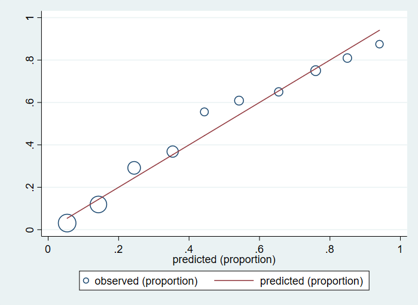
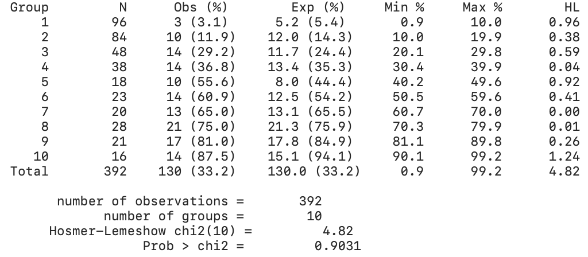

# Introduction
  

# Running Logistic Regession in Stata
This tutorial contains the Hosmer-Lemeshow Stata package, which must be installed
prior toperforming the below example. The installation code is as follows.
```
net from https://www.sealedenvelope.com/
net install hl.pkg
```

## Importing Data and Data Cleaning
We are using the pima dataset in this tutorial. We can import and summarize the 
pima dataset from a CSV file using the following:
```
import delimited using pima.csv, clear
summarize
```

```{r, out.width = "60%", echo=FALSE}
library(knitr)
include_graphics("data_summ1.png") 
```

We see from the summary that the data for `bmi`, `diastolic`, `glucose`, and 
`triceps` containzero values, which are not possible measures of these
parameters. We must therefore clear rows with these values from our dataset.
We can do this as follows:

```
drop if glucose == 0 | diastolic == 0 | triceps ==0 | insulin == 0 | bmi == 0
summarize 
``` 

```{r, out.width = "60%", echo=FALSE}
library(knitr)
include_graphics("data_summ2.png") 
```


We can see that we now have 392 observations from the initial 768, and
all values are now within reasonable range. 

## Implementing Logistic Regression Model
For this model, our response variable is `test` which indicates whether
or not a patient tested positive for diabetes. Note that the rest of the 
variables are numeric and continuous, so we can use them as is in our
regression model. Using all other variables as independent variables,
we can generate the full model using this code:

```
logit test pregnant glucose diastolic triceps insulin bmi diabetes age
```

```{r, out.width = "60%", echo=FALSE}
library(knitr)
include_graphics("logit_full.png") 
```

## Backward Elimination with BIC
We now want to determine the best fit model for the given data. Starting with the
full model, we use backward elimination to drop variables one-by-one and th
BayesianInformation Criterion (BIC) to determine if the model is an improvement. 
  
We first get the BIC of the full model using the following command: 
```
estat ic
```

```{r, out.width = "60%", echo=FALSE}
library(knitr)
include_graphics("bic_full.png") 
```

To determine the order at which to drop the variables, we can use Stata's `stepwise`
function using a 95% confidence level. 
```
stepwise, pr(0.05): logit test pregnant glucose diastolic triceps insulin bmi diabetes age
```

```{r, out.width = "60%", echo=FALSE}
library(knitr)
include_graphics("stepwise.png") 
```
  
From this, we get the dropping order`diastolic`, `insulin`, `triceps`, `pregnant`.

First, we drop `diastolic`.
```
// Model 1 (drop diastolic):
quietly logit test pregnant glucose triceps insulin bmi diabetes age
estat ic
```

```{r, out.width = "60%", echo=FALSE}
library(knitr)
include_graphics("bic_model1.png") 
```

From this, we get a BIC of 391.8057, an improvement from the full model. 
We then, we drop `insulin`.

```
// Model 2 (drop insulin):
quietly logit test pregnant glucose triceps bmi diabetes age
estat ic
```

```{r, out.width = "60%", echo=FALSE}
library(knitr)
include_graphics("bic_model2.png") 
```

Our BIC is now 386.223. Dropping the variable `triceps` we get another
improved model.
```
// Model 3 (drop triceps): 
quietly logit test pregnant glucose bmi diabetes age
estat ic
```

```{r, out.width = "60%", echo=FALSE}
library(knitr)
include_graphics("bic_model3.png") 
```

This gives us a BIC of 380.7127, still an improvement from the previous.
Lastly, dropping `pregnant` we use the following code and summary:

```
// Model 4 (drop pregnant): 
logit test glucose bmi diabetes age
estat ic
```

```{r, out.width = "60%", echo=FALSE}
library(knitr)
include_graphics("logit_final.png") 
include_graphics("bic_model4.png") 
```

We see that all variables are now signifcant and we get a minimized BIC of 
377.0913 for this model. 

## Model Fitting
Now that we have a final model, we can create a new column `p` which contains
the fitted values of our model using the following command:

``` 
predict p
```

# Classification Report
To determine the accuracy of our model, we can generate a classification report
using the following:
```
estat classification
```
  
```{r, out.width = "60%", echo=FALSE}
library(knitr)
include_graphics("class.png") 
```

The results show 79.59% correctly classified observations.

# ROC Curve
These results can be plotted on a Receiving Operator Characteristic (ROC) Curve
using the following command:
```
lroc, title("Receiving Operator Characteristic Curve") xtitle("False Positive Rate") ytitle("True Positive Rate")
```

```{r, out.width = "60%", fig.cap = "ROC Curve", echo=FALSE}
library(knitr)
include_graphics("roc_curve.png") 
```
  

  
```{r, out.width = "60%", echo=FALSE}
library(knitr)
include_graphics("roc_auc.png") 
```

We get an area under the ROC curve of 0.8605, which is close to 1.00, indicative of
good model accuracy.

# Hosmer-Lemeshow Test 
The Hosmer-Lemeshow Test is a goodness-of-fit test for logistic regression models. 
It maps the expcted probabilities against the observations in subgroups of the 
model population. We group the data into deciles of fitted values then plot
these into a Calibration Plot using the following code:
```
egen dec=cut(p), at(0(0.1)1) // generating deciles // 
hl test p, q(dec) plot
```

```{r, out.width = "60%", echo=FALSE, fig.cap = "Calibration Plot"}
library(knitr)
 
```
  
   
     
```{r, out.width = "60%", echo=FALSE}
library(knitr)
 
```
  
The plotted values are close to the diagonal, and we get a p-value of almost 10%, 
indicating a good model fit. 


## References
- https://en.wikipedia.org/wiki/Receiver_operating_characteristic#Area_under_the_curve
- https://www.sealedenvelope.com/stata/hl/
- https://en.wikipedia.org/wiki/Hosmer%E2%80%93Lemeshow_test

  
  


